# 🧠 Live-Learn Assist

<div align="center">
  
  <br />
  <h3><i>"Empowering Learning Through Accessible AI"</i></h3>
</div>

---

## 🚀 Project Overview

**Live-Learn Assist** is an AI-powered Augmented Reality (AR) mobile application designed to break down barriers in education for students with learning disabilities, specifically **dyslexia** and reading difficulties.

Unlike standard OCR tools that just "read" text, Live-Learn Assist **understands** and **transforms** it. By combining real-time computer vision (YOLOv8) with text simplification algorithms, the app converts complex handwritten or printed educational material into a readable, accessible, and interactive format instantly.

---

## 🎯 Problem Statement

Traditional educational environments often rely heavily on dense textbooks and handwritten notes, which can be overwhelming for the **1 in 5 students** who struggle with dyslexia or reading comprehension. 

Standard tools (like Google Lens) capture text but often fail to format it for accessibility or simplify the language, leaving the student with the same complex block of text—just digital. There is a gap for a tool that not only digitizes text but actively makes it easier to read and understand.

---

## 💡 Solution

**Live-Learn Assist** bridges this gap by offering an intelligent layer between the student and the physical world. It uses a **custom-trained YOLOv8 model** to detect text regions (books, notes) and applies **OCR + NLP** to clean, format, and simplify the content.

**Key Differentiator:** The app includes a dedicated **"Dyslexia Mode"** that reformats text with specific fonts, spacing, and colors proven to aid readability, along with a "Simplify" feature that breaks down complex sentences into bullet points.

---

## ✨ Key Features

* **Real-Time AR Text Detection**
Instantly detects and captures text from handwritten notes, textbooks, and screens using a camera feed.

* **Dyslexia-Friendly Reading Mode 👓**
A dedicated toggle that transforms captured text with:
*   High-contrast cream/off-white backgrounds (reduces visual stress).
*   OpenDyslexic-style spacing and font sizing.
*   Clearer line separation to prevent "dancing letters."

* **"Simplify" Text Engine ✨**
One-tap summarization converting dense paragraphs into easy-to-read bullet points or short, digestible sentences.

* **Complex Word Highlighting 🟡**
Automatically identifies long or difficult words (>10 chars). Tapping a highlighted word explains it or suggests a simpler synonym.

* **Smart Gallery Import 🖼️**
Allows users to upload existing images/screenshots for the same advanced accessibility processing.

* **Live Accessibility Badge**
UI indicators confirming when the app is actively processing in accessibility mode.

---

## 📸 App Screenshots

| Home Screen (Live) | Detection & OCR | Dyslexia Mode |
|:---:|:---:|:---:|
|  |  |  |

---

## 🛠️ Tech Stack

### **Mobile Frontend (The Interface)**
*   **Framework:** React Native (Expo)
*   **Language:** JavaScript (ES6+)
*   **Libraries:** `expo-camera`, `expo-image-picker`, `expo-speech` (Text-to-Speech)
*   **Design:** Custom Accessibility-First UI

### **Backend API (The Brain)**
*   **Server:** Python (FastAPI) + Uvicorn
*   **Computer Vision:** Ultralytics YOLOv8 (Object Detection)
*   **OCR Engine:** EasyOCR / Tesseract (Text Extraction)
*   **Image Processing:** OpenCV (Preprocessing, Thresholding)
*   **Performance:** GPU Acceleration (optimized for NVIDIA RTX 3050)

---

## 🏗️ Architecture

```mermaid
graph TD;
    Mobile[📱 Mobile App] -->|Sends Image| API[🌐 FastAPI Server];
    API -->|Inference| YOLO[👁️ YOLOv8 Model];
    YOLO -->|Detects Region| Crop[✂️ Crop & Preprocess];
    Crop -->|Extracts Text| OCR[📝 OCR Engine];
    OCR -->|Raw Text| NLP[🧠 Text Simplification];
    NLP -->|JSON Response| Mobile;
    Mobile -->|Renders UI| User[👤 Student];
```



---

## ⚙️ Setup Instructions

### Prerequisites
*   Node.js & npm
*   Python 3.9+
*   Expo Go app (on mobile)

### 1. Clone Repository
```bash
git clone https://github.com/Tech-Anshika/Live-Learn-Assist.git
cd Live-Learn-Assist
```

### 2. Backend Setup (Python)
Navigate to the model directory and install dependencies:
```bash
cd model-training
pip install -r requirements.txt
# Run the local server
python inference.py
```
*Note: Ensure your backend is reachable (use `localtunnel` or `ngrok` if testing on a physical device over different networks).*

### 3. Mobile App Setup (React Native)
Navigate to the mobile directory:
```bash
cd mobile
npm install
# Start the app
npx expo start
```
Scan the QR code with the **Expo Go** app on your Android/iOS device.

---

## 🎥 Demo Video

[▶️ Watch the Live Demo on Vimeo](https://vimeo.com/1165145984?share=copy&fl=sv&fe=ci)

---

## 🔮 Future Improvements

*   **Offline Support:** Porting the YOLO model to TensorFlow Lite for on-device inference (no internet needed).
*   **Multi-Language Support:** Adding Spanish and Hindi support for broader accessibility.
*   **Text-to-Speech (TTS) Upgrade:** More natural-sounding AI voices for the "Read Aloud" feature.

---

## 👩‍💻 Author

**Anshika Tyagi**  
*Project Lead & Developer*  
[GitHub Profile](https://github.com/Tech-Anshika)

---

## 📄 License

This project is licensed under the MIT License - see the [LICENSE](LICENSE) file for details.
